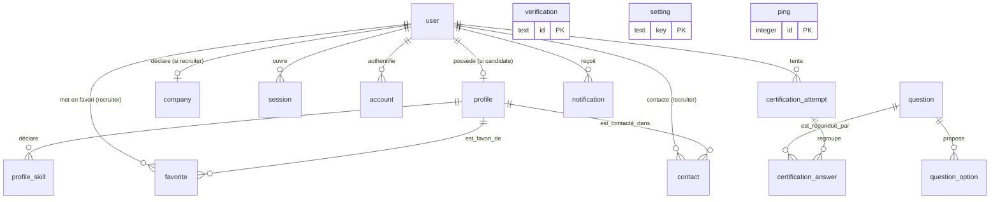

# Schéma de base de données — ProfilsActifs

> Modèle **logique**, cardinalités et index.
> Il décrit ce que produisent les migrations `drizzle/0000_complex_shriek.sql`
> à `drizzle/0006_retention_last_seen.sql`, pas des intentions. Toute
> divergence entre ce document et `src/db/schema.ts` est un bug de l'un des
> deux.

- **SGBD** : SQLite (fichier unique, `DATABASE_URL=file:…`).
- **Migrations** : Drizzle Kit. Rejouées au démarrage par `src/instrumentation.ts`.
- **Conventions de type** (imposées par Drizzle) :
  - horodatages : `integer` = epoch secondes (`unixepoch()` par défaut) ;
  - booléens : `integer` valant `0` / `1` ;
  - identifiants : `text` (UUID v4 applicatif), sauf `ping.id` (`integer` auto-incrément).
- **Vocabulaires fermés** (`sector`, `city`, `skill`, `status`, `role`, `type`) :
  stockés en `text`. **Aucune contrainte `CHECK` en base** — la valeur est
  garantie par les schémas Zod et `src/lib/vocabulary.ts` à l'entrée de l'API.
- **Clés étrangères** : toutes en `ON DELETE CASCADE`, `ON UPDATE NO ACTION`.
  SQLite n'indexe pas automatiquement les colonnes de clé étrangère (voir
  § Index).

---

## 1. Vue d'ensemble (modèle logique)



`verification`, `setting` et `ping` n'ont aucune relation (îlots).

Deux associations **N–N** sont matérialisées par une table de jointure à clé
primaire composite :

| Association | Table de jointure | Clé primaire | Charge utile |
| --- | --- | --- | --- |
| `user` (recruiter) ↔ `profile` — favoris | `favorite` | `(recruiter_id, profile_id)` | `created_at` |
| `user` (recruiter) ↔ `profile` — prises de contact | `contact` | `id` + **UNIQUE** `(recruiter_id, profile_id)` | `message`, `status`, `updated_at` |
| `certification_attempt` ↔ `question` — réponses | `certification_answer` | `(attempt_id, question_id)` | `value` |
| `profile` ↔ compétence (vocabulaire) | `profile_skill` | `(profile_id, skill)` | — |

---

## 2. Tables

### 2.1 Socle d'authentification (better-auth)

Noms et colonnes **imposés** par l'adaptateur Drizzle de better-auth : ne rien
renommer. `user.role` et `user.birth_date` sont les seuls ajouts maison.

#### `user`

| Colonne | Type logique | Contraintes | Défaut |
| --- | --- | --- | --- |
| `id` | text | **PK** | — |
| `name` | text | NOT NULL | — |
| `email` | text | NOT NULL, **UNIQUE** (`user_email_unique`) | — |
| `email_verified` | booléen | NOT NULL | `false` |
| `image` | text | NULL | — |
| `role` | text (`candidate` \| `recruiter` \| `admin`) | NOT NULL | `'candidate'` |
| `birth_date` | text (`AAAA-MM-JJ`) | NULL | — |
| `last_seen_at` | timestamp | NULL | — dernière ouverture de session |
| `created_at` | timestamp | NOT NULL | `unixepoch()` |
| `updated_at` | timestamp | NOT NULL | `unixepoch()` |

**`birth_date`** — date de naissance déclarative, exigée à l'inscription
(vérification de l'âge, R.1). Stockée en **texte** et non en timestamp : c'est
une date civile, sans heure ni fuseau ; un timestamp la décalerait d'un jour
selon le fuseau du serveur, ce qui change l'âge la veille d'un anniversaire.

La colonne est **nullable**, et c'est délibéré : les comptes créés avant cette
exigence n'en portent pas. Toute inscription *nouvelle* la renseigne
obligatoirement — le contrôle vit dans `src/lib/auth.ts` et non dans le seul
formulaire, donc un appel direct à l'API ne le contourne pas. Voir
`docs/verification-age.md` pour le traitement des comptes antérieurs.

**`last_seen_at`** — date de la dernière ouverture de session, écrite par le
hook `databaseHooks.session.create.after` (`src/lib/auth.ts`), jamais par le
client. C'est la **seule** mesure d'inactivité du dispositif, et donc le point
d'ancrage de la durée de conservation d'un compte (R.5) : `updated_at` bouge
dès qu'on touche au profil, et les lignes `session` sont purgées à six mois,
bien avant les vingt-quatre mois d'inactivité. Nullable — les comptes
antérieurs à la colonne n'en portent pas, et la purge retombe alors sur
`created_at`. Voir `docs/registre-traitements.md`.

#### `session`

| Colonne | Type | Contraintes | Défaut |
| --- | --- | --- | --- |
| `id` | text | **PK** | — |
| `expires_at` | timestamp | NOT NULL | — |
| `token` | text | NOT NULL, **UNIQUE** (`session_token_unique`) | — |
| `ip_address` | text | NULL | — |
| `user_agent` | text | NULL | — |
| `user_id` | text | NOT NULL, **FK → `user.id`** (CASCADE) | — |
| `created_at` / `updated_at` | timestamp | NOT NULL | `unixepoch()` |

#### `account`

| Colonne | Type | Contraintes | Défaut |
| --- | --- | --- | --- |
| `id` | text | **PK** | — |
| `account_id` | text | NOT NULL | — |
| `provider_id` | text | NOT NULL | — |
| `issuer` | text | NOT NULL | `''` |
| `user_id` | text | NOT NULL, **FK → `user.id`** (CASCADE) | — |
| `access_token` / `refresh_token` / `id_token` | text | NULL | — |
| `access_token_expires_at` / `refresh_token_expires_at` | timestamp | NULL | — |
| `scope` | text | NULL | — |
| `password` | text | NULL | — hash du mot de passe (provider `credential`) |
| `created_at` / `updated_at` | timestamp | NOT NULL | `unixepoch()` |

#### `verification`

| Colonne | Type | Contraintes | Défaut |
| --- | --- | --- | --- |
| `id` | text | **PK** | — |
| `identifier` | text | NOT NULL | — |
| `value` | text | NOT NULL | — |
| `expires_at` | timestamp | NOT NULL | — |
| `created_at` / `updated_at` | timestamp | NOT NULL | `unixepoch()` |

### 2.2 Domaine métier

#### `profile` — profil de demandeur d'emploi (CDC 2.1)

| Colonne | Type | Contraintes | Défaut |
| --- | --- | --- | --- |
| `id` | text | **PK** | — |
| `user_id` | text | NOT NULL, **UNIQUE** (`profile_user_id_unique`), **FK → `user.id`** (CASCADE) | — |
| `title` | text | NOT NULL | `''` |
| `sector` | text (7 secteurs) | NOT NULL | — |
| `city` | text (8 villes) | NOT NULL | — |
| `bio` | text | NOT NULL | `''` |
| `video_url` | text | NULL | — URL YouTube/Vimeo, jamais un fichier |
| `status` | text (`pending` \| `published` \| `removed`) | NOT NULL | `'pending'` |
| `score` | integer | NULL | — dernier score de certification obtenu |
| `certified_at` | timestamp | NULL | — fait foi pour le badge JEB |
| `views` | integer | NOT NULL | `0` — compteur dénormalisé, **privé** (voir ci-dessous) |
| `contact_count` | integer | NOT NULL | `0` — compteur dénormalisé |
| `video_consent_granted` | integer (booleen) | NOT NULL | `false` — accord en cours |
| `video_consent_at` | timestamp | NULL | — date de l'accord, conservee apres un retrait |
| `video_consent_version` | text | NULL | — version du texte acceptee |
| `video_consent_revoked_at` | timestamp | NULL | — date du retrait |
| `video_status` | text (`pending` \| `approved` \| `rejected`) | NOT NULL | `'pending'` |
| `video_review_reason` | text | NULL | — motif montré au candidat |
| `video_reviewed_by` | text | NULL, **FK → `user.id`** (`SET NULL`) | — décideur |
| `video_reviewed_at` | timestamp | NULL | — date de la décision |
| `created_at` / `updated_at` | timestamp | NOT NULL | `unixepoch()` |

Les quatre colonnes `video_consent_*` forment le registre de consentement a la
diffusion video (R.3) : un booleen seul ne permettrait pas d'etablir *ce qui* a
ete accepte ni *quand*. Le retrait remet `granted` a false, date `revoked_at` et
declenche la suppression physique du fichier ; `at` et `version` survivent, comme
trace. Voir `docs/consentement-video.md`.

Les quatre colonnes `video_*` de modération (R.2) portent un statut **propre à
la vidéo**, distinct de `status` : une vidéo fraîchement déposée est `pending`
et n'est servie qu'à son titulaire et à l'administration, même sur un profil
déjà publié. `video_reviewed_by` est en `SET NULL` et non en `CASCADE` :
supprimer un compte d'administration ne doit pas effacer les décisions prises,
seulement leur auteur. Voir `docs/moderation-video.md`.

`views` est tenu en base et incrémenté à chaque consultation, mais ne sort pas
du serveur : il figure dans le seul schéma `MyProfile` et ne s'affiche que dans
l'espace du titulaire. Ni `Profile`, ni `ProfileCard`, ni un export, ni une vue
recruteur ne le portent, et le catalogue ne s'en sert pas pour trier — on ne
classe pas des personnes par audience. Toute mesure d'audience ajoutée plus tard
(compteur de « j'aime » compris) suit la même règle.

#### `profile_skill` — compétences d'un profil

| Colonne | Type | Contraintes |
| --- | --- | --- |
| `profile_id` | text | NOT NULL, **FK → `profile.id`** (CASCADE) |
| `skill` | text (8 compétences) | NOT NULL |
| | | **PK composite `(profile_id, skill)`** |

Table de jointure et non colonne JSON : le catalogue filtre en SQL sur
« possède **toutes** ces compétences » (`GROUP BY … HAVING COUNT`). Le contrat
d'API plafonne à 8 compétences par profil (règle applicative, pas en base).

#### `company` — entreprise rattachée à un compte recruteur

| Colonne | Type | Contraintes | Défaut |
| --- | --- | --- | --- |
| `id` | text | **PK** | — |
| `user_id` | text | NOT NULL, **UNIQUE**, **FK → `user.id`** (CASCADE) | — |
| `name` | text | NOT NULL | — raison sociale |
| `siren` | text | NOT NULL, **UNIQUE** | — neuf chiffres, forme normalisée |
| `position` | text | NOT NULL | — poste du titulaire dans l'entreprise |
| `address` / `postal_code` / `city` | text | NOT NULL | — |
| `sector` | text (7 secteurs) | NOT NULL | — |
| `phone` / `website` | text | NULL | — facultatifs |
| `created_at` / `updated_at` | timestamp | NOT NULL | `unixepoch()` |

Table séparée et non des colonnes sur `user` : ces informations décrivent une
**personne morale**, pas le compte. Les mélanger laisserait une dizaine de
colonnes nulles sur chaque candidat. Relation **1–1** (`unique` sur `user_id`) :
l'inscription recruteur crée le compte et l'entreprise dans la même requête —
un recruteur sans entreprise ne doit pas exister. La clé de Luhn du SIREN est
vérifiée à l'entrée (`src/lib/siren.ts`), pas en base. Voir
`docs/inscription-roles.md`.

#### `question` — question du questionnaire de certification (CDC 2.2)

| Colonne | Type | Contraintes | Défaut |
| --- | --- | --- | --- |
| `id` | text | **PK** | — |
| `text` | text | NOT NULL | — |
| `weight` | integer | NOT NULL | `2` — pondération 1–5 |
| `position` | integer | NOT NULL | `0` |
| `created_at` | timestamp | NOT NULL | `unixepoch()` |

#### `question_option` — réponse possible à une question

| Colonne | Type | Contraintes | Défaut |
| --- | --- | --- | --- |
| `id` | text | **PK** | — |
| `question_id` | text | NOT NULL, **FK → `question.id`** (CASCADE) | — |
| `label` | text | NOT NULL | — |
| `value` | integer | NOT NULL | — points rapportés |
| `position` | integer | NOT NULL | `0` |

#### `certification_attempt` — tentative de certification

| Colonne | Type | Contraintes | Défaut |
| --- | --- | --- | --- |
| `id` | text | **PK** | — |
| `user_id` | text | NOT NULL, **FK → `user.id`** (CASCADE) | — |
| `status` | text (`in_progress` \| `submitted`) | NOT NULL | `'in_progress'` |
| `score` | integer | NULL | — renseigné à la soumission |
| `passed` | booléen | NULL | — |
| `submitted_at` | timestamp | NULL | — |
| `created_at` | timestamp | NOT NULL | `unixepoch()` |

Règle applicative : **au plus une** tentative `in_progress` par utilisateur
(garantie par le code `openAttempt`, pas par une contrainte). L'historique des
tentatives `submitted` est conservé.

#### `certification_answer` — réponse enregistrée dans une tentative

| Colonne | Type | Contraintes |
| --- | --- | --- |
| `attempt_id` | text | NOT NULL, **FK → `certification_attempt.id`** (CASCADE) |
| `question_id` | text | NOT NULL, **FK → `question.id`** (CASCADE) |
| `value` | integer | NOT NULL |
| | | **PK composite `(attempt_id, question_id)`** — un `UPSERT` par (tentative, question) |

#### `favorite` — profil mis en favori par un recruteur (CDC 2.1)

| Colonne | Type | Contraintes |
| --- | --- | --- |
| `recruiter_id` | text | NOT NULL, **FK → `user.id`** (CASCADE) |
| `profile_id` | text | NOT NULL, **FK → `profile.id`** (CASCADE) |
| `created_at` | timestamp | NOT NULL, défaut `unixepoch()` |
| | | **PK composite `(recruiter_id, profile_id)`** |

#### `contact` — prise de contact recruteur → candidat et son suivi

| Colonne | Type | Contraintes | Défaut |
| --- | --- | --- | --- |
| `id` | text | **PK** | — |
| `recruiter_id` | text | NOT NULL, **FK → `user.id`** (CASCADE) | — |
| `profile_id` | text | NOT NULL, **FK → `profile.id`** (CASCADE) | — |
| `message` | text | NOT NULL | — |
| `status` | text (4 statuts, cf. `CONTACT_STATUSES`) | NOT NULL | `'À qualifier'` |
| `created_at` / `updated_at` | timestamp | NOT NULL | `unixepoch()` |
| | | **UNIQUE `(recruiter_id, profile_id)`** (`contact_recruiter_profile`) | |

Recontacter le même candidat **met à jour** la ligne existante (l'unicité
l'impose), elle n'en crée pas une seconde.

#### `notification` — notification destinée à un utilisateur (CDC 2.3)

| Colonne | Type | Contraintes | Défaut |
| --- | --- | --- | --- |
| `id` | text | **PK** | — |
| `user_id` | text | NOT NULL, **FK → `user.id`** (CASCADE) | — |
| `type` | text (`contact` \| `moderation` \| `certification`) | NOT NULL | — |
| `text` | text | NOT NULL | — |
| `read_at` | timestamp | NULL | — `NULL` = non lue |
| `created_at` | timestamp | NOT NULL | `unixepoch()` |

#### `setting` — réglages modifiables par l'administration

| Colonne | Type | Contraintes |
| --- | --- | --- |
| `key` | text | **PK** |
| `value` | text | NOT NULL (valeur sérialisée en chaîne) |
| `updated_at` | timestamp | NOT NULL, défaut `unixepoch()` |

Table clé/valeur : `certificationThreshold`, `catalogPageSize`. Peu nombreux,
lus ensemble, liste évolutive.

#### `ping` — table de démonstration (temporaire)

| Colonne | Type | Contraintes |
| --- | --- | --- |
| `id` | integer | **PK**, AUTOINCREMENT |
| `created_at` | timestamp | NOT NULL, défaut `unixepoch()` |

---

### 2.3 Durées de conservation (R.5)

Aucune colonne ne porte de date d'expiration : les durées sont appliquées par
**suppression**, table par table, depuis `src/server/services/retention.ts`
(exécutée au démarrage puis toutes les 24 heures par `src/instrumentation.ts`).

| Table | Date de référence | Durée |
| --- | --- | --- |
| `user` (+ cascade : `profile`, `profile_skill`, `company`, `session`, `account`, `notification`, `certification_attempt`, `favorite`, `contact`) | `last_seen_at`, à défaut `created_at` | 24 mois — sauf `role = 'admin'` |
| `session` | `created_at` | 6 mois |
| `verification` | `expires_at` | 30 jours |
| `contact` | `updated_at` | 24 mois |
| `favorite` | `created_at` | 24 mois |
| `notification` | `created_at` | 12 mois |
| `certification_attempt` (`submitted`) | `submitted_at` | 24 mois |
| `certification_attempt` (`in_progress`) | `created_at` | 30 jours |
| Fichier vidéo `rejected` | `video_reviewed_at` | 30 jours (la décision, elle, reste) |
| `video_consent_at` / `_version` / `_revoked_at` | `video_consent_revoked_at` | 36 mois |
| `ping` | `created_at` | 7 jours |

Le **fichier** vidéo ne connaît pas la base : aucune cascade ne l'atteint, il
est effacé explicitement avant la ligne. Le registre complet — finalité, base
légale, destinataires — est dans `docs/registre-traitements.md`, et les mêmes
durées sont annoncées aux personnes dans `docs/cgu.md`.

---

## 3. Cardinalités

| Relation | Côté 1 | Côté N | Cardinalité | Support |
| --- | --- | --- | --- | --- |
| Compte ↔ profil | `user` | `profile` | **1 – 0..1** (exactement 1 si `role = candidate`, 0 sinon) | `profile.user_id` NOT NULL + UNIQUE |
| Compte ↔ entreprise | `user` | `company` | **1 – 0..1** (exactement 1 si `role = recruiter`, 0 sinon) | `company.user_id` NOT NULL + UNIQUE |
| Compte ↔ sessions | `user` | `session` | 1 – 0..N | `session.user_id` |
| Compte ↔ comptes d'auth | `user` | `account` | 1 – 1..N | `account.user_id` |
| Compte ↔ tentatives | `user` | `certification_attempt` | 1 – 0..N (≤ 1 `in_progress`) | `certification_attempt.user_id` |
| Compte ↔ notifications | `user` | `notification` | 1 – 0..N | `notification.user_id` |
| Profil ↔ compétences | `profile` | `profile_skill` | 1 – 0..8 | PK `(profile_id, skill)` |
| Question ↔ options | `question` | `question_option` | 1 – 1..N | `question_option.question_id` |
| Tentative ↔ réponses | `certification_attempt` | `certification_answer` | 1 – 0..N | PK `(attempt_id, question_id)` |
| Question ↔ réponses | `question` | `certification_answer` | 1 – 0..N | `certification_answer.question_id` |
| Recruteur ↔ profils (favoris) | — | — | **N – N** | `favorite`, PK `(recruiter_id, profile_id)` |
| Recruteur ↔ profils (contacts) | — | — | **N – N**, ≤ 1 ligne par couple | `contact` + UNIQUE `(recruiter_id, profile_id)` |

---

## 4. Index

### 4.1 Index créés par les migrations

| Index | Table | Colonnes | Type | Rôle |
| --- | --- | --- | --- | --- |
| `user_email_unique` | `user` | `email` | UNIQUE | connexion par e-mail ; unicité du compte |
| `session_token_unique` | `session` | `token` | UNIQUE | résolution de session à chaque requête authentifiée |
| `profile_user_id_unique` | `profile` | `user_id` | UNIQUE | garantit la relation 1–1 compte ↔ profil ; jointure `user → profile` |
| `contact_recruiter_profile` | `contact` | `(recruiter_id, profile_id)` | UNIQUE | un seul fil de suivi par couple ; cible de l'`UPSERT` |
| `company_user_id_unique` | `company` | `user_id` | UNIQUE | garantit la relation 1–1 compte ↔ entreprise |
| `company_siren_unique` | `company` | `siren` | UNIQUE | deux comptes ne déclarent pas la même entreprise |

### 4.2 Index implicites (SQLite)

- **Clé primaire** de chaque table : `text PRIMARY KEY` et `integer PRIMARY KEY
  AUTOINCREMENT` sont indexés d'office.
- **Clés primaires composites** — `profile_skill (profile_id, skill)`,
  `certification_answer (attempt_id, question_id)`,
  `favorite (recruiter_id, profile_id)` : indexées d'office ; l'ordre des
  colonnes rend efficace le filtrage par la **première** colonne
  (`profile_id`, `attempt_id`, `recruiter_id`).

### 4.3 Absence d'index secondaires — assumée

Les migrations ne créent **aucun** index sur :

- les colonnes de clé étrangère hors PK/UNIQUE (`session.user_id`,
  `account.user_id`, `certification_attempt.user_id`, `notification.user_id`,
  `question_option.question_id`, `certification_answer.question_id`,
  `contact.profile_id`, `favorite.profile_id`) — SQLite ne les indexe pas seul ;
- `profile.status`, alors que le catalogue filtre systématiquement sur
  `status = 'published'`.

C'est un choix tenable **au volume du démonstrateur** (jeu de départ : 14
profils, 12 questions). À l'échelle, les index à ajouter en priorité, par une
nouvelle migration, seraient :

```sql
CREATE INDEX profile_status_idx        ON profile (status);
CREATE INDEX contact_profile_idx       ON contact (profile_id);
CREATE INDEX favorite_profile_idx      ON favorite (profile_id);
CREATE INDEX notification_user_idx     ON notification (user_id, read_at);
CREATE INDEX cert_answer_question_idx  ON certification_answer (question_id);
```

Tant qu'ils ne figurent pas dans une migration appliquée, ils ne sont **pas**
dans ce schéma : ce document suit `drizzle/`, pas la feuille de route.
